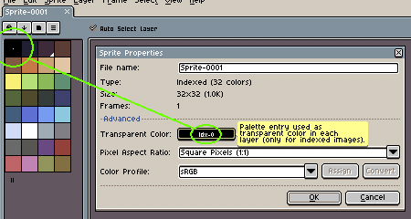

# 透明颜色

在 [RGB](color-mode.md#rgb) 和 [灰度](color-mode.md#灰度) 
精灵中，透明像素是 `Alpha=0` 的颜色，而在 
[索引](color-mode.md#索引) 颜色模式下，调色板中存在一个特定且特殊的索引，它将代表 [透明图层](layers.md#透明图层) 的透明颜色：

这意味着图层中引用此特定索引的像素将不可见（并且只有背景图层可以将“透明颜色”显示为纯色）。

你可以使用鼠标中键在 [颜色栏](color-bar.md) 中更改透明颜色，也可以转到 [*精灵 > 属性*](sprite-properties.md) 菜单选项进行更改。

---

**参阅**

[颜色](color.md) |
[颜色模式](color-mode.md) |
[精灵属性](sprite-properties.md)
