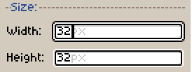

# 用户界面控件

在这里，我们展示一些关于你将在 Aseprite 用户界面 (UI) 上找到的控件/字段的一般信息。

* [精灵编辑器](sprite-editor.md)
* [时间轴](timeline.md)
* [工作区](workspace.md)
* [颜色栏](color-bar.md)

## 数字字段中的数学运算

Aseprite 中的[数字字段](numeric-field.md)可以计算简单的数学表达式：

## 拖放工作区选项卡

你可以[在工作区](workspace.md)中拖放选项卡，按住 <kbd>Ctrl</kbd> 或 <kbd>Alt</kbd> 键并同时按下 <kbd>鼠标左键</kbd> 来复制选项卡：

---

**参阅**

[工作区](workspace.md)
