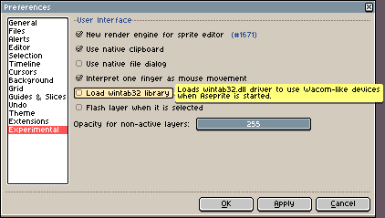
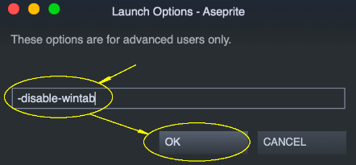

# Wintab

Wintab (`WinTab32.dll`) 是由 Wacom 开发的古老 API，用于让类数位板设备与 Windows 程序进行通信。在 Windows 8 之前，这是从 Wacom 及其他品牌数位板获取压力信息的 “事实上的” 标准。自 Windows 8 起，微软推出了一个新的官方 API：指针 API/Windows Ink。

自 **Aseprite v1.2.34**（以及 **v1.3-beta12**）起，由于我们收到了许多与有问题的第三方 `WinTab32.dll` 文件相关的崩溃报告，我们默认切换到了 Windows 指针 API。（仍可从 [平板选项](tablet.md) 中选择 Wintab 选项。）

在 Aseprite 的早期版本中，我们最初会尝试加载这个 Wintab 库，但这可能会导致程序随机崩溃。有时，你可以通过重新安装驱动程序、重启 Windows、在 [平板选项](tablet.md) 中使用指针 API，或者直接在 *编辑 > 首选项 > 平板*（旧版本中为 *编辑 > 首选项 > 实验性*）中禁用 Wintab 来解决这个问题：

## Aseprite 无法启动

如果你甚至无法启动程序，可以使用 `-disable-wintab` 参数来运行 Aseprite（自 Aseprite v1.2 起可用）：

    "C:\Program Files\Aseprite\Aseprite.exe" -disable-wintab

这将避免加载 `WinTab32.dll` 文件。你的平板可能无法正常工作，但至少 Aseprite 可以启动，并且你可以使用鼠标/触控板进行操作（或者你也可以尝试 [Windows 指针 API](tablet.md)）。

## Steam

在 Steam 中，你可以在 Aseprite 的启动选项中添加 `-disable-wintab` 选项：

1. 在 Steam 库中右键单击 Aseprite，然后打开其“属性”：

   

2. 点击“设置启动项”按钮：

   

3. 添加 `-disable-wintab` 选项，然后点击“确定”：

   

---

**参阅**

[平板](tablet.md) |
[故障排除](troubleshooting.md)
