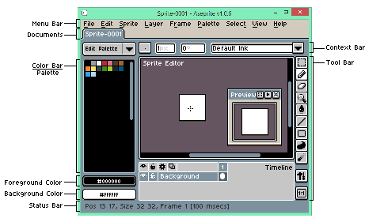
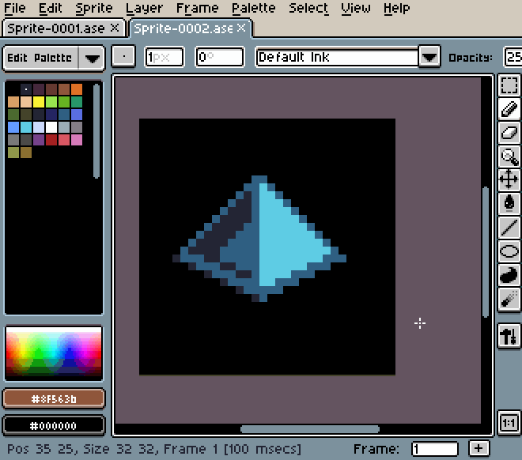

# 工作区

你应该熟悉这些窗口元素：

最重要的元素包括
[精灵编辑器](sprite-editor.md)、
[时间轴](timeline.md)、[颜色栏](color-bar.md)
和 [预览窗口](preview-window.md)。
其他常见的元素有 [菜单栏](menu-bar.md) 和
[工具栏](tool-bar.md)。[状态栏](status-bar.md) 还能为你提供当前精灵的重要信息。

时间轴默认是不可见的，你可以通过 *视图 > 时间轴* 菜单选项或按 <kbd>Tab</kbd> 键使其可见。（当你添加新帧或新图层时，它也会自动弹出。）

## 拖放选项卡

你可以将选项卡拖放到精灵编辑器窗口的任意一侧，也可以按住 <kbd>Ctrl</kbd> 键或 <kbd>Alt</kbd> 键并同时按下 <kbd>鼠标左键</kbd> 来复制选项卡：

---

**参阅**

[颜色栏](color-bar.md) |
[上下文栏](context-bar.md) |
[精灵编辑器](sprite-editor.md) |
[状态栏](status-bar.md) |
[选项卡](tabs.md) |
[时间轴](timeline.md) |
[工具栏](tool-bar.md) |
[菜单栏](menu-bar.md)
