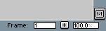
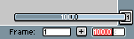

# 缩放工具

你可以使用 （<kbd>Z</kbd> 键），分别通过 <kbd>左键点击</kbd> 和 <kbd>右键点击</kbd> 来进行放大和缩小操作。或者按住鼠标左键，将鼠标从左向右拖动来放大，从右向左拖动来缩小。

你还可以通过状态栏滑块查看/更改缩放级别：

  
  

或者使用其他方式：

* 使用键 <kbd>1</kbd>、<kbd>2</kbd>、<kbd>3</kbd>、<kbd>4</kbd>、
  <kbd>5</kbd>、<kbd>6</kbd>（QWERTY 键上方的数字键），可分别将缩放级别更改为
  100%、200%、400%、800%、1600%、3200%。
* 使用鼠标滚轮（[详情](https://github.com/aseprite/aseprite/issues/2896)）。
* 或者从 **v1.3-beta12** 版本开始，你可以[配置一个按键](drag-value.md)，
  按住该按键并沿特定方向移动鼠标来进行缩放。

---

**参阅**

[绘制](drawing.md) |
[拖动值](drag-value.md) |
[鼠标滚轮行为](https://github.com/aseprite/aseprite/issues/2896)
